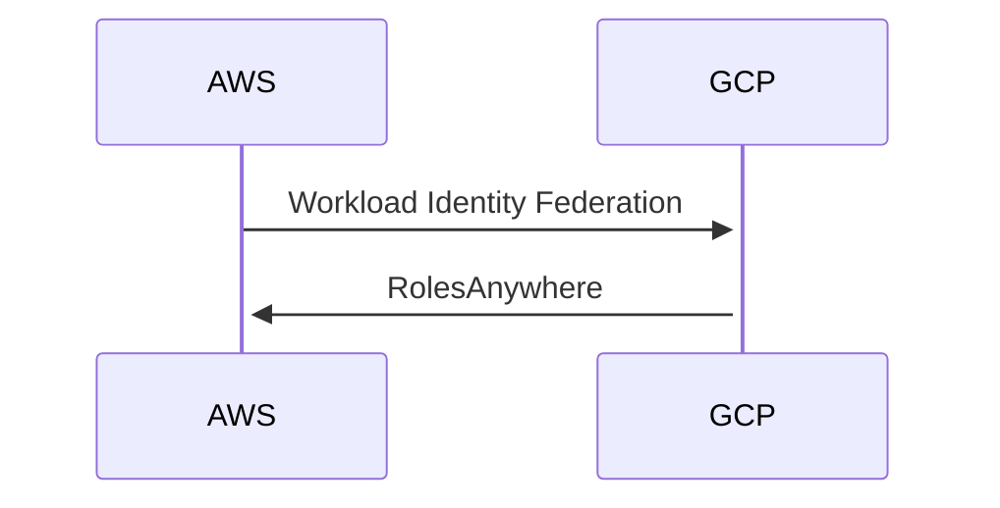

# Bidirectional auth POC

This is to test out how we can create keyless bidirectional authentication between the three main clouds and to ensure
that applications in the different clouds can use features of other clouds if needed. The initial POC will be between 
AWS and GCP to ensure we can use roles to execute different API endpoints in each cloud.


## How we want it to work



#### Aws app

A simple `GET /` endpoint that will connect to a project in GCP and set and get data from a firestore collection to 
respond to the requester. 

#### GCP app

A simple `GET /` endpoint that will connect to an account in AWS and get data from dynamoDB and respond with the data 
to the requester

## Infrastructure

To run the infrastructure you need to ensure you have permissions to create resources in both AWS and GCP and that you
have access to create projects or accounts in both clouds.  
Ensure you have the appropriate environment variables set to run the commands below.

GCP_PROJECT_ID=your-gcp-project-id
GCP_BILLING_ACCOUNT=your-gcp-billing-account
AWS_ACCOUNT_ID=your-aws-account-id
AWS_ROLE_ARN=your-aws-role-arn
AWS_ROLE_NAME=your-aws-role-name

### GCP
#### Prepare project
```shell
gcloud projects create ${GCP_PROJECT_ID}
gcloud beta billing projects link ${GCP_PROJECT_ID} --billing-account=${GCP_BILLING_ACCOUNT}
gcloud config set project "${GCP_PROJECT_ID}"

googleapis=( iam.googleapis.com iamcredentials.googleapis.com cloudresourcemanager.googleapis.com serviceusage.googleapis.com sts.googleapis.com )

# Enable APIs in GCP
for i in "${googleapis[@]}"
do
  gcloud services enable  "${i}"
done
```

#### Create Pool
```shell
gcloud iam workload-identity-pools create aws-to-gcp \
    --location="global" \
    --description="Workload identity pool for aws applications to connect to GCP APIs" \
    --display-name="aws-to-gcp"
    
gcloud iam workload-identity-pools providers create-aws staging-pool \
  --location="global"  \
  --workload-identity-pool="aws-to-gcp" \
  --account-id="${AWS_ACCOUNT_ID}"
```

#### Create service account and bindings
```shell
export PROJECT_NUMBER=`gcloud projects describe ${GCP_PROJECT_ID} --format='value(projectNumber)'`
gcloud iam service-accounts create aws-federated

gcloud iam service-accounts add-iam-policy-binding aws-federated@${GCP_PROJECT_ID}.iam.gserviceaccount.com   \
    --role roles/iam.workloadIdentityUser \
    --member "principal://iam.googleapis.com/projects/$PROJECT_NUMBER/locations/global/workloadIdentityPools/aws-to-gcp/subject/${AWS_ROLE_ARN}"
    
gcloud iam service-accounts add-iam-policy-binding aws-federated@${GCP_PROJECT_ID}.iam.gserviceaccount.com   \
    --role roles/iam.workloadIdentityUser \
    --member "principalSet://iam.googleapis.com/projects/$PROJECT_NUMBER/locations/global/workloadIdentityPools/aws-to-gcp/attribute.aws_role/arn:aws:sts::${AWS_ACCOUNT_ID}:assumed-role/${AWS_ROLE_NAME}" 
```

#### Get the configuration file
```shell
gcloud beta iam workload-identity-pools create-cred-config \
    projects/$PROJECT_NUMBER/locations/global/workloadIdentityPools/aws-to-gcp/providers/staging-pool \
    --service-account=aws-federated@${GCP_PROJECT_ID}.iam.gserviceaccount.com \
    --output-file=sts-creds.json \
    --aws
```

#### Setup permissions
```shell
gcloud projects add-iam-policy-binding ${GCP_PROJECT_ID} --member="serviceAccount:aws-federated@${GCP_PROJECT_ID}.iam.gserviceaccount.com" --role="roles/datastore.user"
```