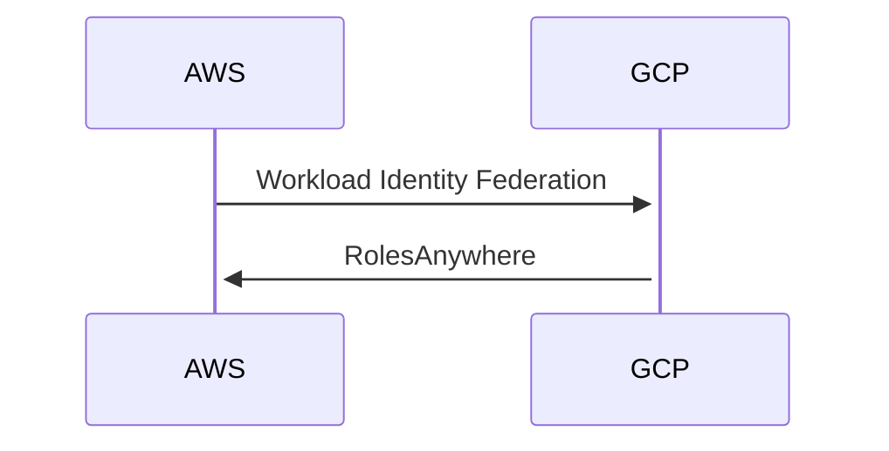

# Bidirectional auth POC

This is to test out how we can create keyless bidirectional authentication between the three main clouds and to ensure
that applications in the different clouds can use features of other clouds if needed. The initial POC will be between 
AWS and GCP to ensure we can use roles to execute different API endpoints in each cloud.

## How we want it to work

#### Aws app

A simple `GET /` endpoint that will connect to a project in GCP and get data from a firestore collection to respond to 
the requester. 

#### GCP app

A simple `GET /` endpoint that will connect to an account in AWS and get data from dynamoDB and respond with the data 
to the requester